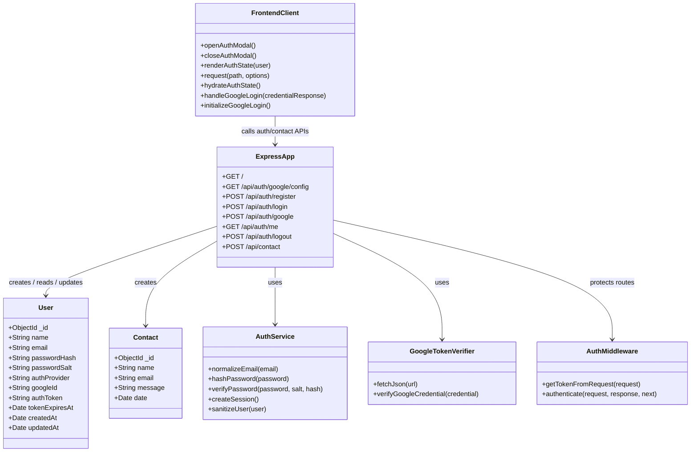

# Class Diagram

```mermaid
classDiagram
    class ExpressApp {
        +GET /
        +GET /api/auth/google/config
        +POST /api/auth/register
        +POST /api/auth/login
        +POST /api/auth/google
        +GET /api/auth/me
        +POST /api/auth/logout
        +POST /api/contact
    }

    class User {
        +ObjectId _id
        +String name
        +String email
        +String passwordHash
        +String passwordSalt
        +String authProvider
        +String googleId
        +String authToken
        +Date tokenExpiresAt
        +Date createdAt
        +Date updatedAt
    }

    class Contact {
        +ObjectId _id
        +String name
        +String email
        +String message
        +Date date
    }

    class AuthService {
        +normalizeEmail(email)
        +hashPassword(password)
        +verifyPassword(password, salt, hash)
        +createSession()
        +sanitizeUser(user)
    }

    class GoogleTokenVerifier {
        +fetchJson(url)
        +verifyGoogleCredential(credential)
    }

    class AuthMiddleware {
        +getTokenFromRequest(request)
        +authenticate(request, response, next)
    }

    class FrontendClient {
        +openAuthModal()
        +closeAuthModal()
        +renderAuthState(user)
        +request(path, options)
        +hydrateAuthState()
        +handleGoogleLogin(credentialResponse)
        +initializeGoogleLogin()
    }

    ExpressApp --> User : creates / reads / updates
    ExpressApp --> Contact : creates
    ExpressApp --> AuthService : uses
    ExpressApp --> GoogleTokenVerifier : uses
    ExpressApp --> AuthMiddleware : protects routes
    FrontendClient --> ExpressApp : calls auth/contact APIs
```
