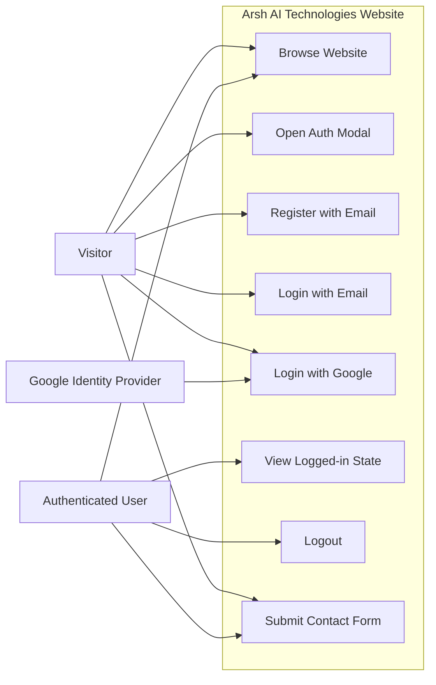

# Use Case Diagram

```mermaid
flowchart LR
    Visitor[Visitor]
    Member[Authenticated User]
    Google[Google Identity Provider]

    subgraph System[Arsh AI Technologies Website]
        UC1[Browse Website]
        UC2[Open Auth Modal]
        UC3[Register with Email]
        UC4[Login with Email]
        UC5[Login with Google]
        UC6[View Logged-in State]
        UC7[Logout]
        UC8[Submit Contact Form]
    end

    Visitor --> UC1
    Visitor --> UC2
    Visitor --> UC3
    Visitor --> UC4
    Visitor --> UC5
    Visitor --> UC8

    Member --> UC1
    Member --> UC6
    Member --> UC7
    Member --> UC8

    Google --> UC5
```
